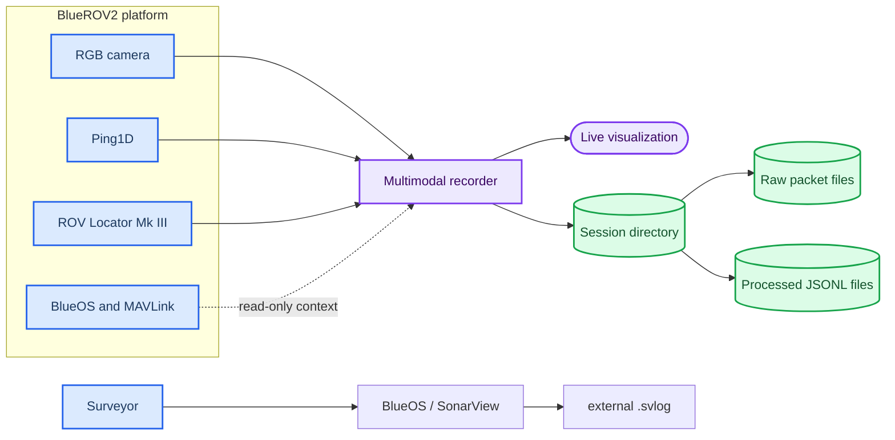
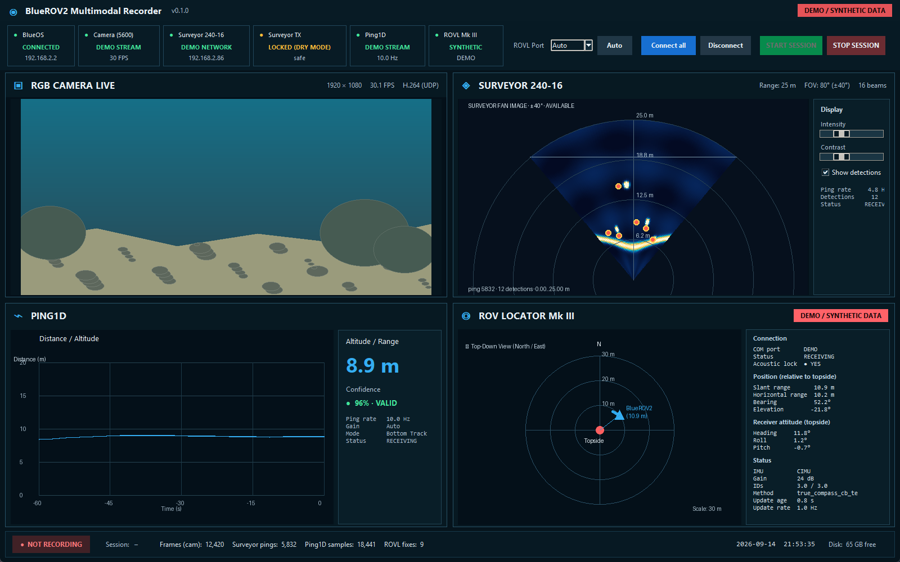

# BlueROV2 Multimodal Recorder

BlueROV2 Multimodal Recorder is a research-oriented acquisition and visualization tool for synchronized RGB camera, Ping1D and optional Cerulean ROV Locator Mk III data. The Cerulean Surveyor 240-16 is recorded independently onboard by BlueOS / SonarView.

The project records raw and processed sensor data locally, provides a live desktop view, and supports offline Surveyor replay. It is intentionally limited to sensing, visualization, recording, and replay.

License: MIT

---

## 📋 Project overview

### Scope

The recorder combines three independent real-hardware inputs:

| Stream | Current connection | Preserved output |
| --- | --- | --- |
| Blue Robotics Ping1D | UDP `192.168.2.2:9090` through BlueOS PingProxy | Distance, confidence, and full `profile_data` when available |
| BlueROV2 RGB camera | UDP `5600`, alternatively `5602` | `camera_rgb.mkv` and timestamp metadata |
| Cerulean ROV Locator Mk III | USB COM, `115200 8N1`, passive read only | Exact NMEA stream, timestamps, decoded positions |

BlueROV2 is operated through BlueOS and an autopilot/flight-controller stack; the recorder does not send vehicle-control commands. The general BlueROV2 platform relationship between BlueOS, the onboard computer, the autopilot, camera, and thrusters is described in the [official BlueROV2 documentation][bluerov2-docs].[^1]

### Architecture

The recorder has separate live-visualization and session-recording paths. The same camera ingest thread fans encoded packets to the recorder and decoded frames to the GUI, so the application does not intentionally create two camera consumers.



See [the detailed architecture](docs/ARCHITECTURE.md) for the synchronization and raw/processed data boundaries.

### Dashboard preview


_Figure 1: Hardware-free dashboard preview; red synthetic-data markers make the simulated ROVL source explicit._

## 🚀 Quick start

### Prerequisites

- Windows with Python 3.8 or newer
- A reachable BlueROV2 network for live acquisition
- BlueOS / SonarView onboard recording for the Surveyor (optional external stream)
- Tkinter, normally included with the Windows Python distribution

The Python package dependencies are listed in [`requirements.txt`](requirements.txt). PyAV is the preferred camera path; OpenCV is retained as the fallback path.

### Install on Windows

```powershell
cd C:\path\to\BlueROV2MultimodalRecorder
py -m venv .venv
.\.venv\Scripts\Activate.ps1
python -m pip install --upgrade pip
python -m pip install -r requirements.txt
```

The source tree uses a `src/` layout. For direct PowerShell commands, expose it for the current shell:

```powershell
$env:PYTHONPATH = "$PWD\src"
```

The supplied launcher sets this path automatically:

```bat
scripts\start_recorder.bat --offline
```

Launch the hardware-free locator demonstration with the same Windows launcher:

```bat
scripts\start_recorder.bat --demo-rovl
```

The demo updates at approximately `1 Hz`, shows an obvious synthetic marker, and disables **START SESSION** by default.

### Start the application

```bat
scripts\start_recorder.bat
```

The launcher starts only the desktop Camera/Ping1D/ROVL recorder. It never
opens the Surveyor socket and has no wet-authorize or auto-start flags.

### Camera selection

The GUI provides a read-only camera-port selector for UDP `5600` and `5602`, plus an optional local SDP path or SDP-capable URL. The included [`config_bluerov_5600.sdp`](config_bluerov_5600.sdp) is a small example for the default RTP port; it does not modify BlueOS.

### Session workflow

1. Select UDP `5600` or `5602`, or enter an SDP/URL.
2. Press **Connect all** for the configured live inputs, or use `--offline` / `--demo`.
3. Press **START SESSION**.
4. Press **STOP SESSION** before closing the GUI.
5. Press **Disconnect** when the live connection is no longer needed.

The session recorder creates a unique directory under `records/real_sessions/`. Existing recordings are never overwritten by a new session.

## 📊 Recorded dataset

A normal session can produce:

```text
records/real_sessions/<session_id>/
├── session.json
├── events.jsonl
├── camera_rgb.mkv
├── camera_timestamps.csv
└── ping1d.jsonl
```

Surveyor `.svlog` files are produced externally by BlueOS/SonarView. `ping1d.jsonl` retains both the distance record and the full normalized profile record when the device returns one.

Camera PTS/DTS and time-base values are stored only when supplied by PyAV. Host `monotonic_ns` and `utc_ns` values are recorded separately so samples can be matched without treating container PTS as a wall clock.

When a physical ROVL is connected, the same directory also contains `rovl_raw.nmea`, `rovl_timestamps.csv`, and `rovl_positions.jsonl`. These optional files are not created for sessions without the locator or for the display-only synthetic demo.

The complete field-level contract is in [`docs/DATA_FORMAT.md`](docs/DATA_FORMAT.md).

The passive serial protocol, coordinate-frame rules, and hardware-test checklist are documented in [`docs/ROV_LOCATOR.md`](docs/ROV_LOCATOR.md).

## 🔄 Offline Surveyor analysis

The live recorder has no Surveyor replay flag. Analyze an existing `.svlog`
with the standalone log viewer:

```bat
scripts\start_log_viewer.bat --summary --file records\example.svlog
```

Equivalent module invocation:

```powershell
$env:PYTHONPATH = "$PWD\src"
python -m bluerov_recorder.log_viewer --summary --file records\example.svlog
```

The standalone read-only log explorer can index and summarize `.svlog` files:

```bat
scripts\start_log_viewer.bat --summary --file records\example.svlog
```

Replay a complete recorder session with its optional ROVL trajectory and nearest host-monotonic sample:

```bat
scripts\start_log_viewer.bat --session records\real_sessions\<session_id>
```

Legacy sessions containing Surveyor files remain readable by offline tools.

## 🧪 Testing

The test suite is hardware-independent and creates synthetic Ping Protocol and ROVL sentences in temporary directories. It covers checksums, fragmented serial framing, tolerant `$USRTH` parsing, coordinate conversion, timestamp matching, session files with and without ROVL, demo data, dry-mode safety, GUI construction, and package import without connected hardware or `pyserial`.

```powershell
python -m pytest -v
```

Tests that require an optional PyAV codec path skip themselves when PyAV or an encoder is unavailable. No real recording or large dataset is required.

## 🔧 Troubleshooting

### The GUI opens but a stream is offline

- Verify the PC is on the vehicle Ethernet network.
- Check BlueOS at `192.168.2.2`.
- Confirm that Surveyor recording is active in BlueOS/SonarView (the desktop app does not connect to it).
- Confirm PingProxy at `192.168.2.2:9090`.
- Check that the selected camera port matches the BlueOS stream output.

### The camera does not display

Try the alternate UDP port, enter the SDP path/URL, and check the reported backend. PyAV is preferred for encoded-packet remux; OpenCV is only a fallback and cannot preserve encoded PTS/DTS in the same way.

### Surveyor data is unavailable in the desktop dashboard

This is intentional. Use BlueOS/SonarView for onboard Surveyor capture and the
offline log viewer for later analysis.

## 📁 Repository layout

```text
BlueROV2MultimodalRecorder/
├── src/bluerov_recorder/
│   ├── app.py
│   ├── processing.py
│   ├── log_viewer.py
│   ├── surveyor.py
│   ├── ping1d.py
│   ├── camera.py
│   ├── recorder.py
│   └── synchronization.py
├── scripts/
├── docs/
├── tests/
├── records/.gitkeep
├── requirements.txt
├── LICENSE
└── README.md
```

Large recordings and generated media are ignored by Git. Small synthetic fixtures may be placed explicitly under `tests/fixtures/`.

## 🎯 Future 3D reconstruction

The long-term objective is to fuse successive Surveyor measurements into a global seabed point cloud while the BlueROV2 moves over or beside the seafloor. Each ping provides geometry in the local sensor frame; a global reconstruction additionally needs a time-aligned vehicle/sensor pose.

This repository does not fabricate global pose or claim a global 3D reconstruction. ROVL adds a time-aligned acoustic position relative to its topside unit, but it does not by itself guarantee a survey-grade or complete six-degree-of-freedom trajectory. A future read-only telemetry stream such as `vehicle_telemetry.jsonl` can be added while preserving the current session files.

See [`docs/RECONSTRUCTION_3D.md`](docs/RECONSTRUCTION_3D.md) for the proposed extension.

## 🔗 References

- [BlueROV2 platform documentation][bluerov2-docs]
- [BlueROV2 product information][bluerov2-product]
- [Cerulean Surveyor 240-16 product page][surveyor-product]
- [Surveyor ATOF point-data definition][surveyor-atof]
- [Surveyor Python getting-started guide][surveyor-python]
- [Ping Protocol Ping1D messages][ping-protocol]
- [Cerulean ROVL packet format][rovl-packet]
- [Cerulean `$USRTH` field definition][rovl-usrth]

License: MIT. See [`LICENSE`](LICENSE).

[bluerov2-docs]: https://bluerobotics.com/learn/bluerov2-software-setup/
[bluerov2-product]: https://bluerobotics.com/store/rov/bluerov2/
[surveyor-product]: https://ceruleansonar.com/product/surveyor-240-16/
[surveyor-atof]: https://docs.ceruleansonar.com/c/surveyor-240-16/application-programming-interface/atof_point_data
[surveyor-python]: https://docs.ceruleansonar.com/c/surveyor-240-16/getting-started-with-ping-python
[ping-protocol]: https://docs.bluerobotics.com/ping-protocol/pingmessage-ping1d/
[rovl-packet]: https://docs.ceruleansonar.com/c/rov-locator/communicating-with-the-rovl/packet-format
[rovl-usrth]: https://docs.ceruleansonar.com/c/rov-locator/communicating-with-the-rovl/messages-from-rovl-to-host/usdusrth-receiver-transmitter-relative-angles-message

[^1]: Blue Robotics. “BlueROV2 Software, Network, and Joystick Setup Instructions.” https://bluerobotics.com/learn/bluerov2-software-setup/
