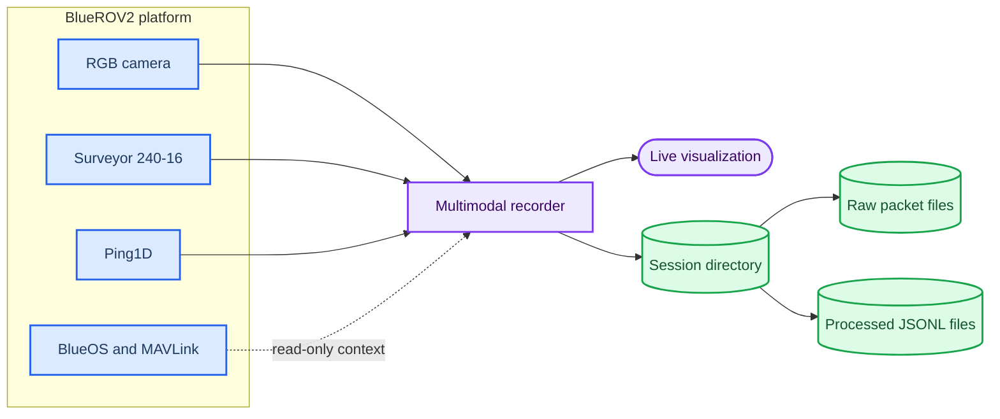

# BlueROV2 Multimodal Recorder

BlueROV2 Multimodal Recorder is a research-oriented acquisition and visualization tool for synchronized underwater sensing using a BlueROV2 equipped with a Cerulean Surveyor 240-16 multibeam sonar, a Blue Robotics Ping1D single-beam sonar, and an RGB camera.

The project records raw and processed sensor data locally, provides a live desktop view, and supports offline Surveyor replay. It is intentionally limited to sensing, visualization, recording, and replay.

License: MIT

---

## 📋 Project overview

### Scope

The recorder combines three independent real-hardware inputs:

| Stream | Current connection | Preserved output |
| --- | --- | --- |
| Cerulean Surveyor 240-16 | TCP `192.168.2.86:62312` | Raw Ping Protocol packets and processed ping records |
| Blue Robotics Ping1D | UDP `192.168.2.2:9090` through BlueOS PingProxy | Distance, confidence, and full `profile_data` when available |
| BlueROV2 RGB camera | UDP `5600`, alternatively `5602` | `camera_rgb.mkv` and timestamp metadata |

BlueROV2 is operated through BlueOS and an autopilot/flight-controller stack; the recorder does not send vehicle-control commands. The general BlueROV2 platform relationship between BlueOS, the onboard computer, the autopilot, camera, and thrusters is described in the [official BlueROV2 documentation][bluerov2-docs].[^1]

### Architecture

The recorder has separate live-visualization and session-recording paths. The same camera ingest thread fans encoded packets to the recorder and decoded frames to the GUI, so the application does not intentionally create two camera consumers.



See [the detailed architecture](docs/ARCHITECTURE.md) for the synchronization and raw/processed data boundaries.

### Screenshots

No hardware screenshot is committed yet. Add future UI captures under `docs/images/` and link them here after removing any sensitive network or vehicle identifiers.

## 🚀 Quick start

### Prerequisites

- Windows with Python 3.8 or newer
- A reachable BlueROV2 network for live acquisition
- A local `.svlog` file for offline Surveyor replay
- Tkinter, normally included with the Windows Python distribution

The Python package dependencies are listed in [`requirements.txt`](requirements.txt). PyAV is the preferred camera path; OpenCV is retained as the fallback path.

### Install on Windows

```powershell
cd C:\path\to\BlueROV2MultimodalRecorder
py -m venv .venv
.\.venv\Scripts\Activate.ps1
python -m pip install --upgrade pip
python -m pip install -r requirements.txt
```

The source tree uses a `src/` layout. For direct PowerShell commands, expose it for the current shell:

```powershell
$env:PYTHONPATH = "$PWD\src"
```

The supplied launcher sets this path automatically:

```bat
scripts\start_recorder.bat --offline
```

### Start the application

```bat
scripts\start_recorder.bat
```

The normal startup is **DRY / TX LOCKED**. It may connect for passive reading, but it must not enable Surveyor transmission. The GUI keeps the Surveyor start control disabled unless the explicit `--wet-authorized` flag is supplied:

```bat
scripts\start_recorder.bat --wet-authorized
```

Use that flag only after the hardware and the in-water safety procedure have been independently approved. It is not used by the launcher default or the offline tests.

### Camera selection

The GUI provides a read-only camera-port selector for UDP `5600` and `5602`, plus an optional local SDP path or SDP-capable URL. The included [`config_bluerov_5600.sdp`](config_bluerov_5600.sdp) is a small example for the default RTP port; it does not modify BlueOS.

### Session workflow

1. Select UDP `5600` or `5602`, or enter an SDP/URL.
2. Press **Connect all** for the configured live inputs, or use `--offline` / `--replay-surveyor`.
3. Press **START SESSION**.
4. Press **STOP SESSION** before closing the GUI.
5. Press **Disconnect** when the live connection is no longer needed.

The session recorder creates a unique directory under `records/real_sessions/`. Existing recordings are never overwritten by a new session.

## 📊 Recorded dataset

A normal session can produce:

```text
records/real_sessions/<session_id>/
├── session.json
├── events.jsonl
├── camera_rgb.mkv
├── camera_timestamps.csv
├── surveyor_raw.svlog
├── surveyor_pings.jsonl
└── ping1d.jsonl
```

`surveyor_raw.svlog` stores the original received Surveyor packet stream. `surveyor_pings.jsonl` is the processed convenience representation and may contain ATOF detections, channel-data status, range, speed of sound, ping rate, ping number, device timestamp, and optional attitude. The GUI beamforms validated channel data in memory; the source channel packets remain in the raw file. `ping1d.jsonl` retains both the distance record and the full normalized profile record when the device returns one.

Camera PTS/DTS and time-base values are stored only when supplied by PyAV. Host `monotonic_ns` and `utc_ns` values are recorded separately so samples can be matched without treating container PTS as a wall clock.

The complete field-level contract is in [`docs/DATA_FORMAT.md`](docs/DATA_FORMAT.md).

## 🔄 Offline replay

Replay does not connect to the Surveyor and does not send acoustic commands:

```bat
scripts\start_recorder.bat --offline --replay-surveyor records\example.svlog
```

Equivalent module invocation:

```powershell
$env:PYTHONPATH = "$PWD\src"
python -m bluerov_recorder.app --offline --replay-surveyor records\example.svlog
```

The standalone read-only log explorer can index and summarize `.svlog` files:

```bat
scripts\start_log_viewer.bat --summary --file records\example.svlog
```

`--skip-surveyor` omits the live Surveyor worker. If replay and `--skip-surveyor` are both supplied, replay takes precedence so the requested `.svlog` can still be visualized.

## 🧪 Testing

The test suite is hardware-independent and creates synthetic Ping Protocol packets in temporary directories. It covers packet framing, Surveyor decoding and record construction, `.svlog` replay, Ping1D profile normalization, JSON serialization, timestamp matching, dry-mode safety, GUI construction, and package import without connected hardware.

```powershell
python -m pytest -v
```

Tests that require an optional PyAV codec path skip themselves when PyAV or an encoder is unavailable. No real recording or large dataset is required.

## 🔧 Troubleshooting

### The GUI opens but a stream is offline

- Verify the PC is on the vehicle Ethernet network.
- Check BlueOS at `192.168.2.2`.
- Confirm the Surveyor address `192.168.2.86:62312`.
- Confirm PingProxy at `192.168.2.2:9090`.
- Check that the selected camera port matches the BlueOS stream output.

### The camera does not display

Try the alternate UDP port, enter the SDP path/URL, and check the reported backend. PyAV is preferred for encoded-packet remux; OpenCV is only a fallback and cannot preserve encoded PTS/DTS in the same way.

### The Surveyor start button is locked

This is the expected default safety state. A live start requires explicit `--wet-authorized`; replay and offline paths never need it.

### A fan image is unavailable during replay

The `.svlog` must contain a complete set of eight message-`3009` channel-pair packets for a ping. ATOF-only logs still provide detections and polar views, but do not contain enough channel data for the reconstructed fan image.

## 📁 Repository layout

```text
BlueROV2MultimodalRecorder/
├── src/bluerov_recorder/
│   ├── app.py
│   ├── processing.py
│   ├── log_viewer.py
│   ├── surveyor.py
│   ├── ping1d.py
│   ├── camera.py
│   ├── recorder.py
│   └── synchronization.py
├── scripts/
├── docs/
├── tests/
├── records/.gitkeep
├── requirements.txt
├── LICENSE
└── README.md
```

Large recordings and generated media are ignored by Git. Small synthetic fixtures may be placed explicitly under `tests/fixtures/`.

## 🎯 Future 3D reconstruction

The long-term objective is to fuse successive Surveyor measurements into a global seabed point cloud while the BlueROV2 moves over or beside the seafloor. Each ping provides geometry in the local sensor frame; a global reconstruction additionally needs a time-aligned vehicle/sensor pose.

This repository does not fabricate global pose or claim a global 3D reconstruction. A future read-only telemetry stream such as `vehicle_telemetry.jsonl` can be added while preserving the current session files. The planned fields are attitude, depth, local position when available, velocity, and timestamps; the source and quality of those fields still require verification on the deployed vehicle.

See [`docs/RECONSTRUCTION_3D.md`](docs/RECONSTRUCTION_3D.md) for the proposed extension.

## 🔗 References

- [BlueROV2 platform documentation][bluerov2-docs]
- [BlueROV2 product information][bluerov2-product]
- [Cerulean Surveyor 240-16 product page][surveyor-product]
- [Surveyor ATOF point-data definition][surveyor-atof]
- [Surveyor Python getting-started guide][surveyor-python]
- [Ping Protocol Ping1D messages][ping-protocol]

License: MIT. See [`LICENSE`](LICENSE).

[bluerov2-docs]: https://bluerobotics.com/learn/bluerov2-software-setup/
[bluerov2-product]: https://bluerobotics.com/store/rov/bluerov2/
[surveyor-product]: https://ceruleansonar.com/product/surveyor-240-16/
[surveyor-atof]: https://docs.ceruleansonar.com/c/surveyor-240-16/application-programming-interface/atof_point_data
[surveyor-python]: https://docs.ceruleansonar.com/c/surveyor-240-16/getting-started-with-ping-python
[ping-protocol]: https://docs.bluerobotics.com/ping-protocol/pingmessage-ping1d/

[^1]: Blue Robotics. “BlueROV2 Software, Network, and Joystick Setup Instructions.” https://bluerobotics.com/learn/bluerov2-software-setup/
