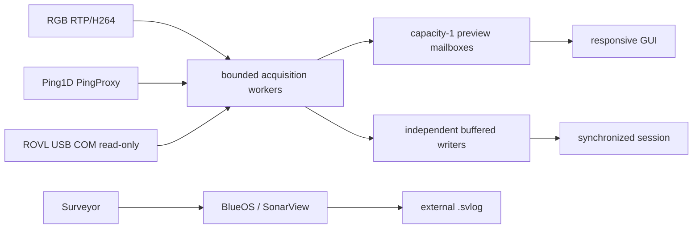
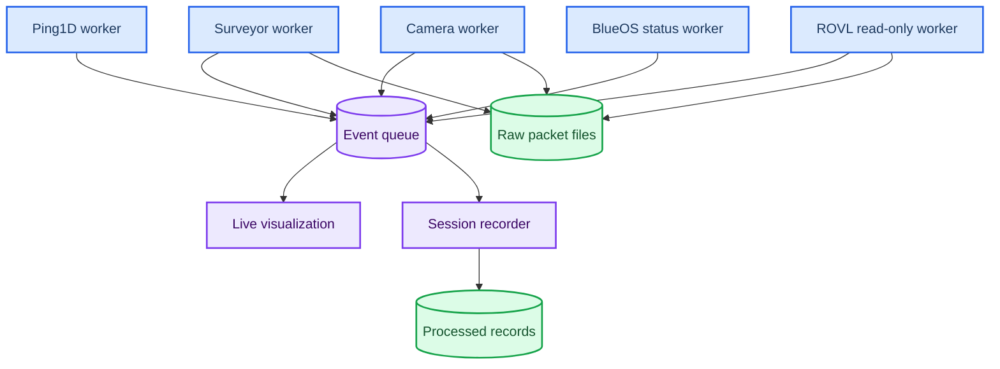

# Architecture (current live recorder)

> The desktop live path owns only RGB camera, Ping1D and read-only ROVL. The
> Surveyor 240-16 is external: BlueOS/SonarView captures its `.svlog` onboard.
> The legacy Surveyor sections below describe offline compatibility only.

The GUI never performs I/O or heavy processing. Camera uses single ingest with
encoded remux plus latest-only preview; Ping1D preserves full profiles; ROVL
preserves exact NMEA bytes and decoded positions. Records carry host monotonic
and UTC nanoseconds, while camera PTS/DTS and device clocks remain separate.
Writers batch/flush and fsync on close. Bounded queues and diagnostics expose
rates, drops, queue health, CPU/RSS and GUI heartbeat.

_Runtime architecture for live visualization, synchronized recording, and offline replay._

---

## 📋 System boundary

The application is a Windows desktop process with one worker per external stream and a shared event queue. The GUI consumes events for display; the session recorder consumes the same logical samples for durable output. The Surveyor processing module contains protocol parsing and fan beamforming but no device-control code.

## 👁️ Live visualization

The GUI shows the current camera frame, Surveyor fan image/ATOF information, Ping1D distance history, ROVL top-down track, connection badges, and Surveyor TX state. The ROVL panel exposes lock, range, bearing/elevation, IMU state, age, update rate, coordinate method, and a bounded trail. Live visualization is transient and is not the authoritative dataset.

## 💾 Session recording

`START SESSION` creates a unique directory and opens the JSONL, CSV, and raw packet writers. The session can be started before or after `Connect all`; the camera callback is attached and detached under the worker/session lifecycle rules. `STOP SESSION` flushes and closes the files and adds session-end timestamps to `session.json`.

The camera worker uses a single ingest path. With PyAV, encoded packets are offered to the session remuxer and decoded frames are sent to the GUI. With the fallback path, decoded frames are written through OpenCV when available.

## 🧱 Raw and processed data

| Layer | Examples | Purpose |
| --- | --- | --- |
| Raw | `surveyor_raw.svlog`, encoded camera packets in `camera_rgb.mkv` | Preserve source bytes and native video timing where available |
| Processed | `surveyor_pings.jsonl`, `ping1d.jsonl`, `events.jsonl`, `camera_timestamps.csv` | Make decoded values, event history, and synchronization metadata easy to consume |
| Session metadata | `session.json` | Describe configuration, modes, camera backend, and lifecycle timestamps |

The application does not replace the raw Surveyor packets with a simplified point list. It writes the convenience records in parallel.

ROVL artifacts are additive and lazy. `rovl_raw.nmea`, `rovl_timestamps.csv`, and `rovl_positions.jsonl` are opened only for an active non-synthetic ROVL connection. Older sessions and sessions recorded without the locator retain their previous structure.

## ⏱️ Synchronization

Each stream sample receives a host `monotonic_ns` timestamp and a host `utc_ns` timestamp at ingest. ROVL GNSS/device time is retained separately when present. Monotonic time is used for nearest-sample matching because it is not affected by wall-clock adjustments. UTC is retained for human correlation and cross-machine bookkeeping.

Camera `pts`, `dts`, and time-base fields are kept separately from the host clocks. A container PTS is a media-clock value; it is not silently treated as UTC. `match_surveyor_ping()` finds the nearest camera frame and Ping1D sample by host monotonic time and reports signed deltas in milliseconds.

## 🔄 Replay boundary

`--replay-surveyor FILE.svlog` creates a passive replay worker. It reads Ping Protocol frames from the file, rebuilds ATOF/channel/attitude/end-ping records, and emits the same logical Surveyor events used by the live worker. It does not instantiate `Surveyor240`, open the hardware TCP endpoint, or send a ping-enable command.

## 🧩 Extension point

Vehicle telemetry is deliberately not faked. A future read-only worker can emit `vehicle_telemetry.jsonl` events with a stable session identity and host timestamps. Existing files and readers should remain valid when that optional stream is added.
