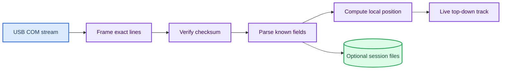

# ROV Locator integration

_Passive Cerulean ROV Locator Mk III acquisition, geometry, recording, and replay contract._

---

## 📋 Overview

The ROVL integration listens to the topside USB COM stream at `115200 8N1`. Cerulean documents an ASCII NMEA-compatible packet format, CRLF termination, empty fields, and checksums after `*`.[^1] The current `$USRTH` schema has 19 ordered fields and may gain additional trailing fields, so the parser preserves unknown suffixes instead of enforcing a fixed field count.[^2]



## 🔐 Read-only safety boundary

`src/bluerov_recorder/rovl.py` has no device-write method. Auto discovery opens candidate COM ports only long enough to listen for a Cerulean `US` sentence, closes each probe, and never sends identification commands. The worker does not configure the IMU, calibration, channel, baud rate, sound speed, transceiver, transponder, or acoustic behavior.

## 📥 Message handling

The parser recognizes `$USRTH`, `$USINF`, `$USTXT`, `$USERR`, and `$USDEB`. It also preserves forwarded `GP`/`GN` GNSS sentences such as `GPRMC`, `GNRMC`, `GPGGA`, and `GNGGA`. Unknown sentence types remain available through `raw_sentence` and `raw_fields`.

For every line the decoder records:

- Exact raw bytes and line ending
- Host monotonic and UTC nanoseconds
- Message type and raw fields
- Checksum presence, expected/calculated values, and validity
- Parse status and any non-fatal error
- GNSS/device time separately when available

## 📐 Coordinate methods

True position is preferred when `$USRTH` supplies `cb` and `te`. Cerulean defines Compass bearing as North-zero/clockwise and elevation as positive upward.[^3] With angles converted to radians:

```text
horizontal = cos(elevation) × slant_range
north = horizontal × cos(compass_bearing)
east = horizontal × sin(compass_bearing)
vertical_up = slant_range × sin(elevation)
```

If true angles are unavailable but apparent Math bearing/elevation exist, the application computes `relative_x_m` and `relative_y_m` in `RECEIVER_RELATIVE_MATH`. It does not call these coordinates North/East. Missing or invalid range, bearing, or elevation produces `lock: false` and `null` coordinates.

## 🔄 Demo and replay

Run `scripts\start_recorder.bat --demo` for a hardware-free synthetic camera,
Ping1D and ROVL dashboard. The ROVL track is approximately `1 Hz`; recording
is enabled only when the operator presses START SESSION. `--demo-rovl` remains
accepted as a compatibility alias.

Run `scripts\start_log_viewer.bat --session <directory>` to inspect a recorded trajectory. The viewer selects the ROVL sample nearest to the chosen host-monotonic timeline time. Sessions without ROVL remain readable and display an explicit absence message.

## 🔗 References

[^1]: Cerulean Sonar. (2025). “Packet Format.” https://docs.ceruleansonar.com/c/rov-locator/communicating-with-the-rovl/packet-format

[^2]: Cerulean Sonar. (2025). “$USRTH Receiver-Transmitter Relative Angles Message.” https://docs.ceruleansonar.com/c/rov-locator/communicating-with-the-rovl/messages-from-rovl-to-host/usdusrth-receiver-transmitter-relative-angles-message

[^3]: Cerulean Sonar. (2025). “NED or Compass vs. ENU or Math Angles.” https://docs.ceruleansonar.com/c/rov-locator/rovl-coordinate-systems-and-angles/ned-or-compass-vs.-enu-or-math-angles
